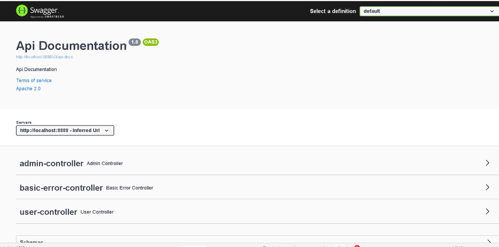
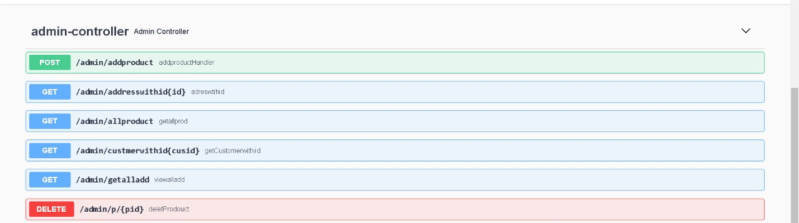
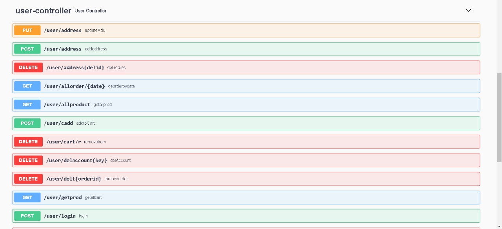
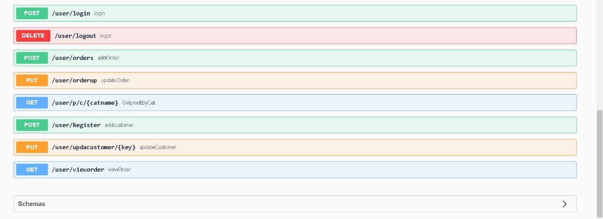

# Online Shopping Application 🛒

This is a Individual project, I have built a rest API service for an Online Shopping Application.

## Entity Relationship Diagram

 * Loding please wait 

## Functionalities

* User can register/login
* See all products
* Find products by category
* Add to cart/edit into the cart
* Place Order

## Backend Work

 * Proper Exception Handling
 *Proper Input Validation
 * Data Stored in the database(mySQL)
 * User Authentication of signUp and Login

## Tech Stacks
* Java Core
* Spring Data JPA
* Hibernate
* MySQL
* Spring Boot

## Installation and Run
* Update the port number, username and password as per our local database config.

-  server.port=8080
- spring.datasource.url=jdbc:mysql://localhost:3306/DatabaseName
- spring.datasource.driver-class-name=com.mysql.cj.jdbc.Driver
- spring.datasource.username=root
- spring.datasource.password=YourPassword
- spring.jpa.hibernate.ddl-auto=update

## Swagger UI 🛒

  

## Admin Controller 🛒

  

## User Controller 🛒

  

  

## Thank You
